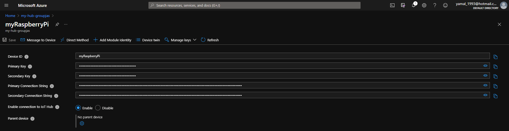
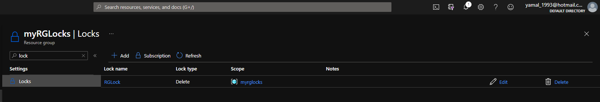

# 01 - Create a virtual machine in the portal

# 02 - Create a Web App

# 03 - Deploy Azure Container Instances

# 04 - Create a virtual network

# 05 - Create blob storage

# 07 - Implement an Azure IoT Hub

# 10-Create a VM with PowerShell

# 11-Create a VM with the CLI.md

# 12 - Implement Azure Key Vault

# 13-Secure network traffic

# 14 - Manage access with RBAC

# 15 - Manage resource locks

# 16 - Implement resource tagging

# 17 - Create an A Policy

# 19 - Use the Pricing Calculator

# 20 - Use the Azure TCO Calculator

